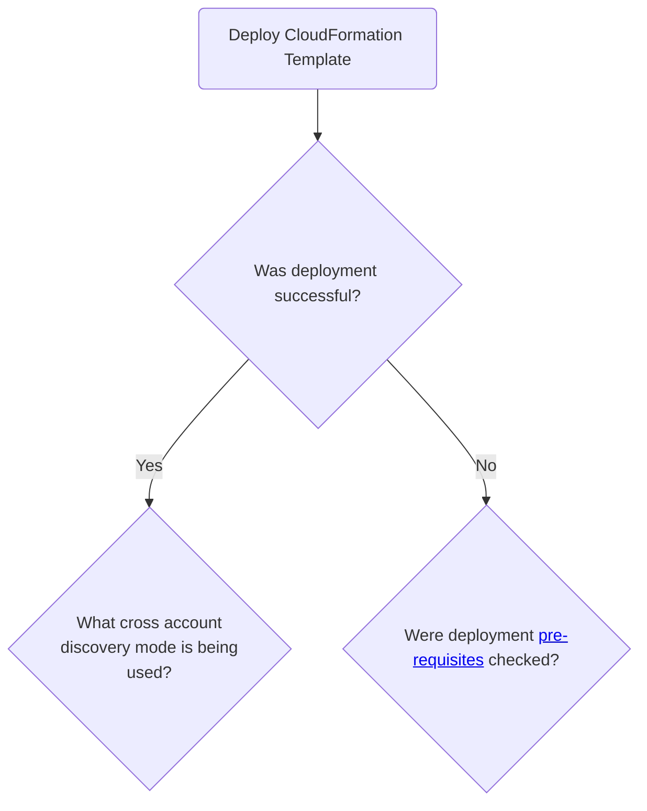

Amazing mermaid flow chart

```mermaid
flowchart TD
A(Deploy CloudFormation Template)
A --> B{Was deployment successful?}
B -->|Yes| C{"What cross account
discovery mode is being
used?"}
B -->|No| D{Were deployment <u><a href='https://docs.aws.amazon.com/solutions/latest/workload-discovery-on-aws/deployment-process-overview.html'>pre-requisites</a></u> checked?}

```
